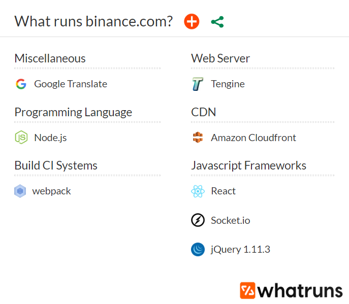
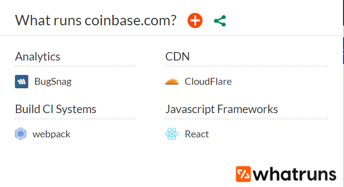

# Final Year Project

## Introduction

### Project Title

SpringCloud-based digital currency exchange platform

### Project Overview

In this system I will try to provide as many as possible basic services. The main features include:

- Supporting multiple languages
- Registration and signing in
- Assets management
- Trading currency
- Showing market trending charts (K-Line)
- Predict the currency price (deep reinforcement learning)

If time enough, a mobile application will also be developed. In person, I would like to exercise my ability in developing **Microservices** project and am interested in **blockchain**. This is the reason I want to build this system.

I plan to mark my project in three big stages. First is designing the project architecture. Second is developing the system according to different function modules, and in this stage, there will be several steps like admin module, member module, trading module and statistics module. And last is refactoring and deploying.

## Technology

### Similar Websites

#### Binance

#### Coinbase

BugSnag: an error monitoring and reporting software with best-in-class functionality

### My Project

#### Backend

- Spring Boot: Java-based framework
- Spring Cloud / Spring Cloud Alibaba: Microservice framework
- Spring Security: Authentication and access-control framework
- MyBatis / MyBatis-plus: Persistence framework (Object–relational mapping)
- MySQL + Mongodb + Redis: Database

#### Frontend

- Vue.js: Popular frontend framework
- Element UI: Vue Component UI Library
- Axios: Send requests
- Vue-i18n: Supports multiple languages

#### DevOps

- Docker: Easy to config the environment and deploy software
- Jenkins: CI&CD (continuous integration, continuous deployment)

#### Other

Deep Reinforcement Learning : Predict the currency value and make strategies.

## Database

### Member System Tables

1. user_info

   |  id  | name              | type | length | null | primary | default | description |
   | :--: | :---------------- | ---- | ------ | ---- | ------- | ------- | ----------- |
   |  1   | id                |      |        |      |         |         |             |
   |  2   | type              |      |        |      |         |         |             |
   |  3   | username          |      |        |      |         |         |             |
   |  4   | country_code      |      |        |      |         |         |             |
   |  5   | mobile            |      |        |      |         |         |             |
   |  6   | email             |      |        |      |         |         |             |
   |  7   | password          |      |        |      |         |         |             |
   |  8   | paypassword       |      |        |      |         |         |             |
   |  9   | auth_status       |      |        |      |         |         |             |
   |  10  | level             |      |        |      |         |         |             |
   |  11  | status            |      |        |      |         |         |             |
   |  12  | access_key_id     |      |        |      |         |         |             |
   |  13  | access_key_secret |      |        |      |         |         |             |
   |  14  | login_times       |      |        |      |         |         |             |
   |  15  | created_time      |      |        |      |         |         |             |
   |  16  | last_update_time  |      |        |      |         |         |             |

2. user_sms

   | id   | name             | type | length | null | primary | default | description |
   | ---- | ---------------- | ---- | ------ | ---- | ------- | ------- | ----------- |
   | 1    | id               |      |        |      |         |         |             |
   | 2    | template_code    |      |        |      |         |         |             |
   | 3    | country_code     |      |        |      |         |         |             |
   | 4    | mobile           |      |        |      |         |         |             |
   | 5    | content          |      |        |      |         |         |             |
   | 6    | status           |      |        |      |         |         |             |
   | 7    | last_update_time |      |        |      |         |         |             |
   | 8    | created_time     |      |        |      |         |         |             |

3. user_login_log

   | id   | name          | type | length | null | primary | default | description |
   | ---- | ------------- | ---- | ------ | ---- | ------- | ------- | ----------- |
   | 1    | id            |      |        |      |         |         |             |
   | 2    | user_id       |      |        |      |         |         |             |
   | 3    | device_type   |      |        |      |         |         |             |
   | 4    | login_ip      |      |        |      |         |         |             |
   | 5    | login_address |      |        |      |         |         |             |
   | 6    | login_time    |      |        |      |         |         |             |

4. user_wallet_address

   | id   | name             | type | length | null | primary | default | description |
   | ---- | ---------------- | ---- | ------ | ---- | ------- | ------- | ----------- |
   | 1    | id               |      |        |      |         |         |             |
   | 2    | user_id          |      |        |      |         |         |             |
   | 3    | coin_id          |      |        |      |         |         |             |
   | 4    | address          |      |        |      |         |         |             |
   | 5    | keystore         |      |        |      |         |         |             |
   | 6    | pwd              |      |        |      |         |         |             |
   | 7    | created_time     |      |        |      |         |         |             |
   | 8    | last_update_time |      |        |      |         |         |             |

### Admin System Tables

1. sys_menu

   | id   | name             | type | length | null | primary | default | description |
   | ---- | ---------------- | ---- | ------ | ---- | ------- | ------- | ----------- |
   | 1    | id               |      |        |      |         |         |             |
   | 2    | parent_id        |      |        |      |         |         |             |
   | 3    | parent_key       |      |        |      |         |         |             |
   | 4    | name             |      |        |      |         |         |             |
   | 5    | desc             |      |        |      |         |         |             |
   | 6    | target_url       |      |        |      |         |         |             |
   | 7    | created_time     |      |        |      |         |         |             |
   | 8    | last_update_time |      |        |      |         |         |             |

2. sys_privilege

   | id   | name             | type | length | null | primary | default | description |
   | ---- | ---------------- | ---- | ------ | ---- | ------- | ------- | ----------- |
   | 1    | id               |      |        |      |         |         |             |
   | 2    | menu_id          |      |        |      |         |         |             |
   | 3    | name             |      |        |      |         |         |             |
   | 4    | desc             |      |        |      |         |         |             |
   | 5    | url              |      |        |      |         |         |             |
   | 6    | pwd              |      |        |      |         |         |             |
   | 7    | created_time     |      |        |      |         |         |             |
   | 8    | last_update_time |      |        |      |         |         |             |

3. sys_role_menu

   | id   | name             | type | length | null | primary | default | description |
   | ---- | ---------------- | ---- | ------ | ---- | ------- | ------- | ----------- |
   | 1    | id               |      |        |      |         |         |             |
   | 2    | role_id          |      |        |      |         |         |             |
   | 3    | menu_id          |      |        |      |         |         |             |
   | 7    | created_time     |      |        |      |         |         |             |
   | 8    | last_update_time |      |        |      |         |         |             |

4. sys_role_privilege

   | id   | name         | type | length | null | primary | default | description |
   | ---- | ------------ | ---- | ------ | ---- | ------- | ------- | ----------- |
   | 1    | id           |      |        |      |         |         |             |
   | 2    | role_id      |      |        |      |         |         |             |
   | 3    | privilege_id |      |        |      |         |         |             |

5. sys_user_log

## Reference

J. Thönes, "Microservices," in IEEE Software, vol. 32, no. 1, pp. 116-116, Jan.-Feb. 2015, doi: 10.1109/MS.2015.11.

URL: https://ieeexplore.ieee.org/stamp/stamp.jsp?tp=&arnumber=7030212&isnumber=7030140

Dragoni, N. *et al.* (2017). Microservices: Yesterday, Today, and Tomorrow. In: Mazzara, M., Meyer, B. (eds) Present and Ulterior Software Engineering. Springer, Cham. https://doi.org/10.1007/978-3-319-67425-4_12

URL: https://arxiv.org/pdf/1606.04036.pdf

Nofer, Michael, et al. "Blockchain." *Business & Information Systems Engineering* 59.3 (2017): 183-187.

URL: http://cs.unibo.it/~danilo.montesi/CBD/Articoli/2017Blockchain.pdf